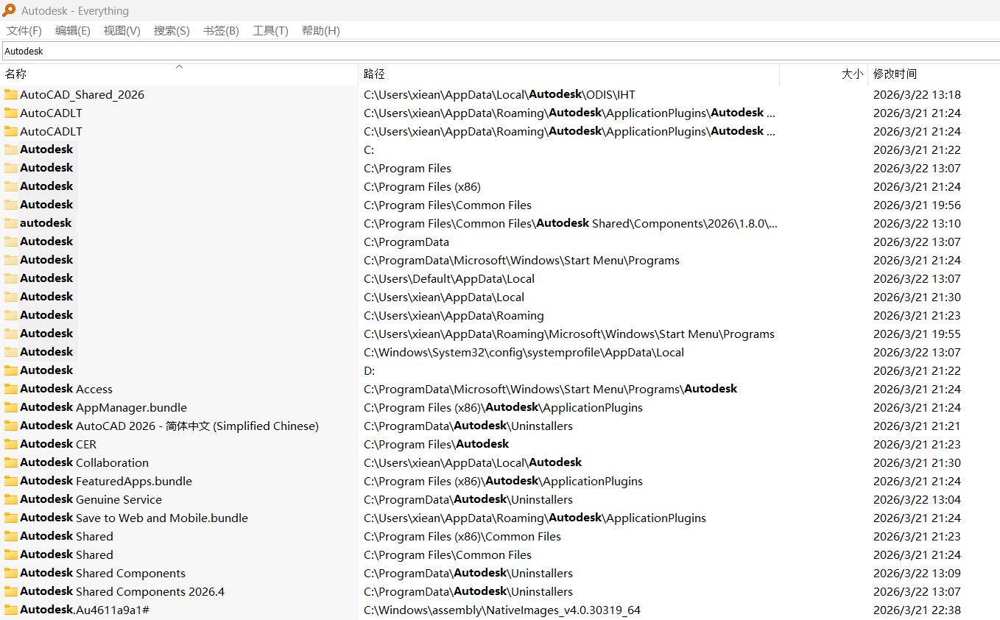

# 解决AutoCAD 2026安装过程中的'4000'报错

## 问题描述

* 在安装 AutoCAD 2026 时，安装程序中提示 **“安装无法完成 错误 4000”**，进度条回退，安装程序清理在安装前选中的整个文件夹。
* 我在安装过 AutoCAD 2026 英文版后卸载，尝试安装中文版后发现第一次安装成功，但是打开直接报错，于是进行清理各种名称为 `Autodesk` 的文件夹。

## 处理过程

### 1. 清理文件

使用 [**Everything**](https://www.voidtools.com/zh-cn/downloads/) 搜索 `Autodesk` 并进行逐个删除，不能删除的使用工具（火绒）来粉碎或解除占用（也可以手动在任务管理器里面挨个强行停止）：

```Text
C:\Program Files\Autodesk
C:\Program Files (x86)\Autodesk
C:\Program Files\Common Files\Autodesk
C:\Program Files\Common Files\Autodesk Shared\Components\2026\1.8.0\parameterschemas\autodesk
C:\ProgramData\Autodesk
C:\ProgramData\Microsoft\Windows\Start Menu\Programs\Autodesk
C:\Users\Default\AppData\Local\Autodesk
C:\Users\xiean\AppData\Local\Autodesk
C:\Users\xiean\AppData\Roaming\Autodesk
C:\Users\xiean\AppData\Roaming\Microsoft\Windows\Start Menu\Programs\Autodesk
C:\Users\xiean\Desktop\AutoDesk
C:\Windows\System32\config\systemprofile\AppData\Local\Autodesk
```



### 2. 抓取日志

这似乎并不管用，我只是删除了文件夹，后来无奈跟随弹出的指引下载了Log抓取工具：[**AdskODISLogCollectionTool**](https://www.autodesk.com.cn/support/technical/article/caas/sfdcarticles/sfdcarticles/CHS/How-to-Use-the-Log-Collection-Tool.html)
打开后同意，输入`y`回车。

* 发现问题：
抓取到的 `ODIS/Install.log` 里面有一行：

```Log
2026-03-21T18:36:26.116 [InstallManager DEBUG][ Autodesk::DDAUtils::RegistryUtils::RegistryCreateKey ] Create registry failed. Hive: HKLM path: SOFTWARE\Classes\Aec32BitAppServer.AecADOMgr.3\CLSID errorCode: 5
...
2026-03-21T18:36:26.143 [InstallManager INFO] [ InstallManager::HandleInstallFailure ] Failed to install Package (upi2: {AC59A6C2-130B-3B80-8682-EFCC01CBE970} name: ACA & MEP 2026 Object Enabler ) Error Code: 4000 Exit Status: 4000
```

* 喂给AI帮我解释：

> *errorCode: 5 在 Windows 系统中代表 “拒绝访问” (Access Denied)。*
> *这意味着之前安装的英文版 AutoCAD 在注册表中留下了 Aec32BitAppServer.AecADOMgr.3 这个键值，并且它的权限被锁死了（可能所有者变成了 SYSTEM 或 TrustedInstaller）。当中文版安装程序试图覆盖或写入这个键值时，因为没有权限被系统拒绝，从而触发了 4000 错误并回滚。*

### 3. 解决过程

* 直接删除注册表条目会无权限，发现需要授权，而且 `Aec32BitAppServer.AecADOMgr.3` 不仅有3，还有1和2，我试图全部清理，发现这也需要权限。
由于不能批量删除，我最初使用了 [**RegistryFinder**](http://registry-finder.com/) 作为批量编辑的工具。
* 仅仅删除这三个值并不管用，我在删除过程中发现了许多前缀为 `Aec32BitAppServer` 的注册值。因为太多了，需要批量授权，所以后来使用了EasyU来在PE里删除，PE里面的工具是 **RegWorkshop** ，也可以进行编辑。但是需要加载配置单元，目标在系统盘的：`C:\Windows\System32\config\SOFTWARE` 。导入之后就可以进行编辑了。

> [!TIPS]
>  这里有个误区，我在`HKEY_CLASSES_ROOT`下也发现了这个注册值，但是后来才发现，`HKEY_CLASSES_ROOT`是在系统加载的时候读取并映射的，所以只需要编辑`HKEY_LOCAL_MACHINE`下的值就可以了。

## 总结

删除 `Aec32BitAppServer` 前缀的注册表项，清理 `Autodesk` 文件夹残留，重新安装就成功了。